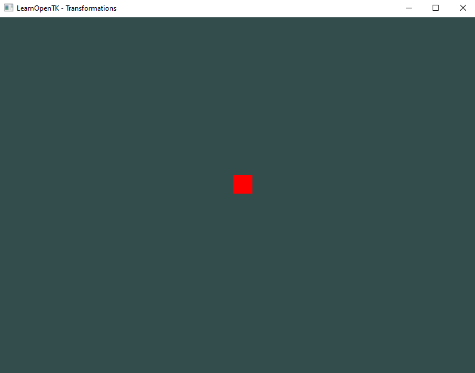

# OpenGL Basisoefeningen

- lees:

Deze reeks oefeningen sluit aan op je huidige projectopzet met **OpenTK**, een `MainWindow` met een `MainDefaultShader`, en je `Shape`-hiërarchie (waar `Plane`, `Circle` en `Triangle` van erven). In je project worden de matrices als uniforms doorgegeven met o.a. `shader.SetModelM(...)`, `shader.SetMatrix4("view", ...)`, en `shader.SetMatrix4("projection", ...)`. Je `Plane` rendert via `plane.Renderer()` en bindt automatisch zijn VAO/VBO. (Zie je huidige `MainWindow.cs` voor de basis. )

# Start

- clone deze repository
    - https://github.com/progsen/opengl_cs_exercises
    - kijk in de map `GLColorDemo`

    - Build & Run
        > mogenlijk moet je nog even een `dotnet restore` doen! 
        > 

