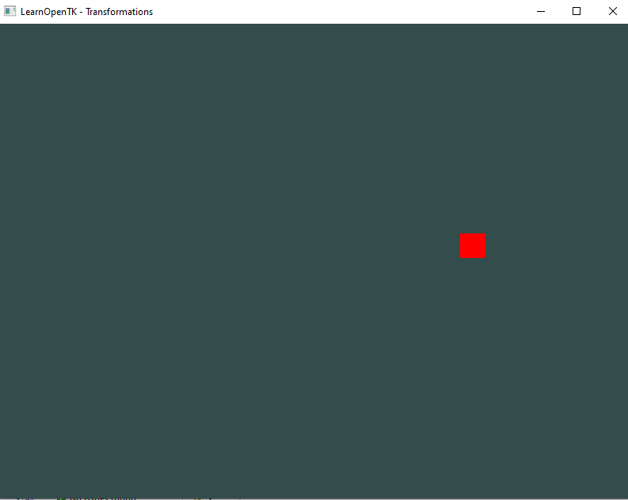
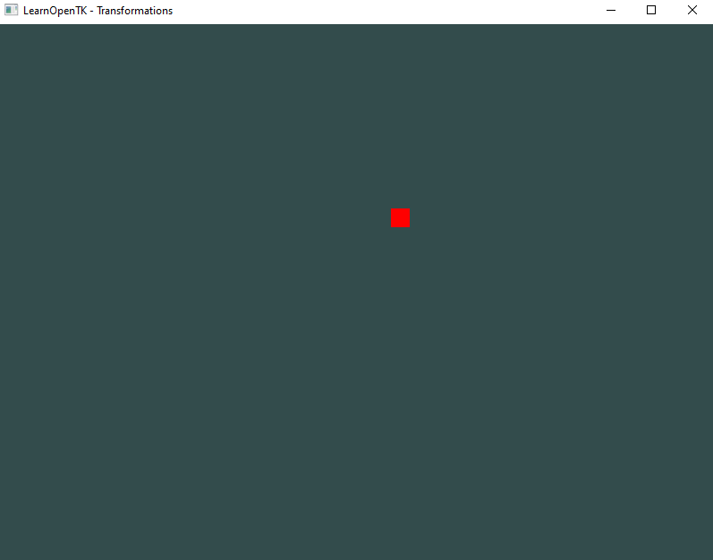

## Oefening 1.A — Beweeg het vlak **met de view-matrix**
**Doel:** Begrijpen dat verplaatsing van de camera (view) hetzelfde effect heeft als het tegengesteld verplaatsen van de wereld.

- Laat het vierkant over de X-as bewegen door de model-matrix te wijzigen:
    - schuif het vierkant 6 op
        > Hint: Matrix4.CreateTranslation
        > 

- lees:
    ```
        - Translations zijn hoe we het verplaatsen noemen. 
        - Als we in Unity kijken zit er in de transform een position. 
            - deze position wordt uiteindelijk een Translation matrix
        

    ```

## Oefening 1.B
**Doel:** zelf een matrix maken die het object beweegt

- lees eerst deze text:
  - [01_translation_matrix_opengl.md](01_translation_matrix_opengl.md)

- pas nu je opdracht van 1.A aan:
    1) pak de float[] uit de tekst, zet die bij je translate code in de buurt
    2) gebruik de function hieronder die in Shader.cs staat om je float[] matrix te gebruiken
        - let op dat je je `Matrix4.CreateTranslation` code uitzet (commentaar)
            > public void SetMatrix4(string name, float[] data)

        - check je uitkomst
        > 


