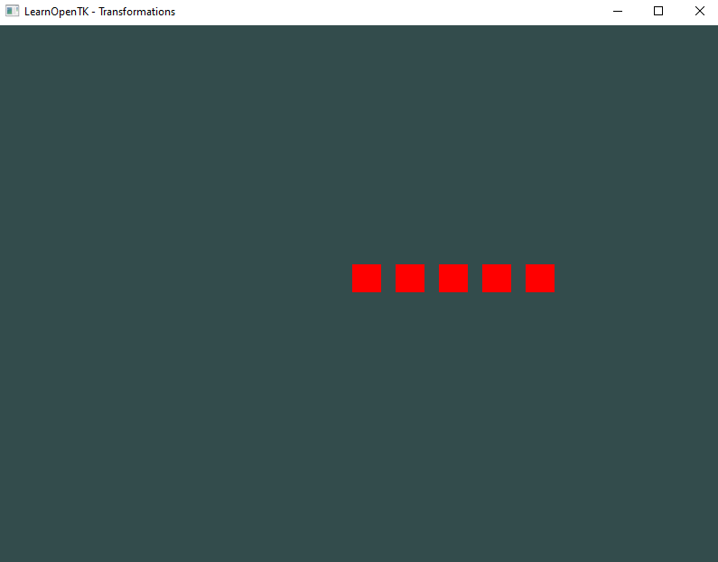

## Oefening 2 — Rij van vlakken, zelfde `Plane` hergebruiken
**Doel:** Meerdere instanties tekenen door uitsluitend de **model-matrix** te variëren.


- lees de opdracht:

    ```
    - Teken 5 vierkanten in een horizontale rij
        - zorg voor ruimte tussen de vierkanten

    - Gebruik één en dezelfde `Plane`-instantie.
    ```

- teken de 5 vierkanten
    > HINTS:
    > je mag een for gebruiken
    > je moet voor elk vierkant:
    > - een matrix maken `Matrix4.CreateTranslation`
    > - de matrix naar de shader uploaden `shader.SetModelM(model)`
    > - en dan renderen
    

- check je uitkomst
    > 
    