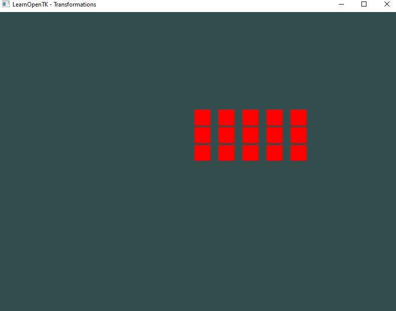

## Oefening 3 — Maak een **grid** van vlakken
**Doel:** Geneste lussen en 2D positionering met de model-matrix.

- Teken nu een grid met 3 rijen (Y) × 5 kolommen (X).
- Gebruik verschillende witruimte
- zorg dat het grid gecentreerd is

- check je uitkomst
    > 
    