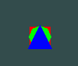

## Oefening 5.A — **Tekenvolgorde**: wie ligt bovenop zonder diepte-test?
**Doel:** Begrijpen dat zónder depth test de **laatst getekende** bovenop ligt.

- ga verder in je project met de shapes
    - zet de vormen op:
        - x:0, y:0, z:0

- Laat de diepte-test uit.
- Teken de drie vormen in deze volgorde:
    - triangle
    - cirlce
    - plane


## Oefening 5.B

- verander nu de Z:
    - triangle:1 
    - cirlce: 0
    - plane: -1


- kijk naar je uitkomst, zie je de trianlge of circle?

- lees:
    ```
    - we zien de circle en triangle NIET
    - ondanks dat deze dichter bij de camera staan
    - dit komt omdat de plane overal overheen tekent
    ```


## Oefening 5.C

- pas nu je Start aan door dit erin te zetten (let op je clear pas je aan!):
    ```cs
    GL.Enable(EnableCap.DepthTest);
    GL.DepthFunc(DepthFunction.Less);

    GL.Clear(ClearBufferMask.ColorBufferBit | ClearBufferMask.DepthBufferBit);
    ```

- als het goed is is nu je triangle bovenop:
    > 
