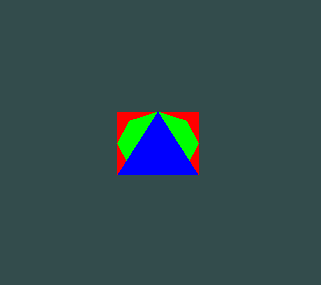
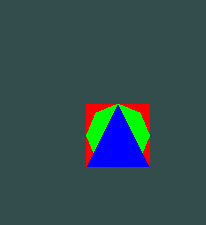
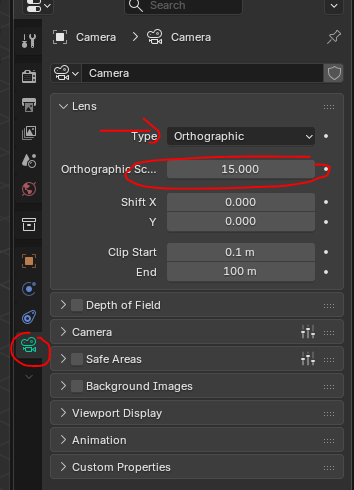

## Oefening 6 Perspective Vs Orthographic
**Doel:** Begrijpen dat je met verschillende projecties andere beelden krijgt

- ga verder in je project met de shapes
    - pas de camera matrix aan:
        > gebruik
        > een near and far van  0.1f en  100
        > een height van 10
        > een width van 10

    - er klopt nu iets niet
        > 
    

## Squashed

- lees:
```
- met Orthographic views moeten met de aspect ratio rekening houden

```

- pas nu de WIDTH aan door:
    - de width (10) KEER de aspectRadio te doen
        > 

## scale

- pas nu de 10 aan naar:
     - 5
     - 20
    - zo pas je aan hoeveel je ziet 
        - dit is de scale, net als in blender:
        > 


## LookAt

- pas nu de Z van de lookat aan:
    - naar 3:
        > er lijkt niets te gebeuren
    - naar 1:
        > je plane verwijnt achter de camera

- gebruik nu LookAt(new Vector3(1, 0, 2)
    - bekijk eerst de Ortho
    - daarna de perspective

## LookAt Z

- blijf in perspective
    - pas de Z aan
        > met een perspective camera heeft het wel effect op 'hoe ver' alles lijkt als je de camera verder zet