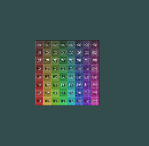

# Tutorial: Textures toevoegen in OpenGL (voor beginners)


# 1. Wat is een texture?

- lees:

Een **texture** is simpelweg een **plaatje** (PNG of JPG) dat je op een vorm plakt.
Je kunt het zien als **stickers op een object**.

Tot nu toe kreeg elk vertex een RGBA‑kleur. Bij textures vervang je dit door **UV‑coördinaten** (waarop het plaatje geplakt wordt).


# 2. Stappenplan
We gaan:

1. De **shader** aanpassen zodat hij textures kan lezen
2. **UV-coördinaten** toevoegen aan je `Shape`
3. Een **Texture loader** maken
4. De texture naar de GPU sturen
5. De shader de kleur laten pakken van de texture


# 3. Vertex shader aanpassen

**shader.vert**

```glsl
#version 330 core

layout(location = 0) in vec3 aPosition;
layout(location = 1) in vec2 aTexCoord;

out vec2 vTexCoord;

uniform mat4 model;
uniform mat4 view;
uniform mat4 projection;

void main()
{
    vTexCoord = aTexCoord;
    gl_Position = projection * view * model * vec4(aPosition, 1.0);
}
```


# 4. Fragment shader aanpassen

**shader.frag**

```glsl
#version 330 core

in vec2 vTexCoord;
out vec4 FragColor;

uniform sampler2D texture0;

void main()
{
    FragColor = texture(texture0, vTexCoord);
}
```


- In `Load` van MainDefaultShader:
    - verander je aColor  naar aTexCoord
        ```csharp
        texCoordLocation = GetAttribLocation("aTexCoord"); 
        ```

# 5. UV‑coördinaten toevoegen aan Shape

- lees:
    ```
    Je oude `stride` was 7 (3 positie + 4 kleur).
    Textures gebruiken **2 floats (u,v)**. Niet 4 floats zoals de kleuren
    ```

- pas je stride aan:
    ```csharp
    stride = 5; // 3 voor positie + 2 voor UV
    ```

- In `Load` van `Shape` pas je de 7 naar stride aan:
    ```csharp
    combinedVBO = new float[vertices.Length / 3 *stride];
    ```

- In `CreateCombinedBuffer()` vul je nu posities en UV’s:

    ```csharp
    for (int i = 0, vi = 0, ti = 0; i < combinedVBO.Length; i += stride, vi += 3, ti += 2)
    {
        combinedVBO[i] = vertices[vi + 0];
        combinedVBO[i + 1] = vertices[vi + 1];
        combinedVBO[i + 2] = vertices[vi + 2];

        combinedVBO[i + 3] = texcoords[ti + 0];
        combinedVBO[i + 4] = texcoords[ti + 1];
    }
    ```

# 6. Plane
- Laten we nu Plane aanpassen:
    - haal colors weg
    - zet dit erin:

        ```csharp
                texcoords = new float[]
                {
                        1, 1,   // top-right
                        1, 0,   // bottom-right
                        0, 0,   // bottom-left
                        0, 1    // top-left
                };
        ```
    - Circle en Triangle hebben ook coordinaten nodig nu
        - voor nu mag je even circle en triangle excluden van het project


# 7. Vertex attrib pointers aanpassen

- In `CreateVertixAttributes()` van Shape:

```csharp
GL.EnableVertexAttribArray(shader.vertexLocation);
GL.VertexAttribPointer(shader.vertexLocation, 3, VertexAttribPointerType.Float, false, stride * sizeof(float), 0);

GL.EnableVertexAttribArray(shader.texCoordLocation);
GL.VertexAttribPointer(shader.texCoordLocation, 2, VertexAttribPointerType.Float, false, stride * sizeof(float), 3 * sizeof(float));
```


# 7. Texture loader class


- zet de volgende file in je project:
    - [GLTextureImage.cs](GLTextureImage.cs)
    

# 8. Texture laden in `MainWindow`

- In **OnLoad()**:

    ```csharp
    texture = new Texture("mijnplaatje.png");
    ```

- Tijdens renderen:

    ```csharp
    texture.Use(shader);
    ```


# 9. Resultaat

- check of alles goed is ingesteld:

    - Je shader gebruikt de texture
    - Je vertices geven UV’s door
    - Een PNG wordt op je vorm geplakt

- Je hebt nu **textures in OpenGL**, zelfs zonder moeilijke terminologie!
    > 


