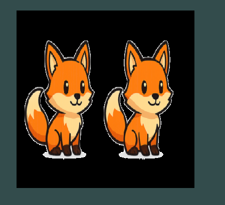
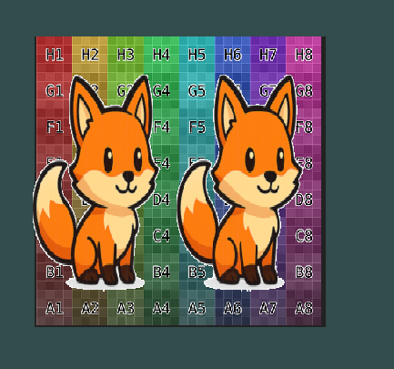
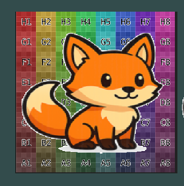

## Oefening 1
**Doel:** een sprite tonen

- pak een plaatje wat een game character is, of laat die generen
    - we hebben minimaal 2 frames aan idle nodig


- render de plane nog een keer, iets dichter bij de camera, met de nieuwe texture
    > 

    > je mist je achtergrond nu 

- lees:
    ```
        - Translations zijn hoe we het verplaatsen noemen. 
        - Als we in Unity kijken zit er in de transform een position. 
            - deze position wordt uiteindelijk een Translation matrix
        

    ```


- pas je Main in je fragment shader aan
    ```

    void main()
    {
        FragColor =texture(texture0, vTexCoord);

        if(FragColor.w < 1)
        {
            discard;
        }
    }
    ```
    > we testen nu of de alpha niet 1 is, als dat waar is renderen we deze pixel niet

- test opnieuw
    > 


## Oefening 2

- zorg nu ervoor dat:
    - je maar 1 frame van je sprite laat zien
    - je achtergrond wel vol laat zien

    > HINTS:
    > - pas je UV aan
    > - vergeet niet de VBO opnieuwe te vullen en naar de gfx card te sturen
    > - je kan 2 planes gebruiken

- controlleer:
    > 
    
- probeer nu ook het andere frame te laten zien (bewaar je oude code!)